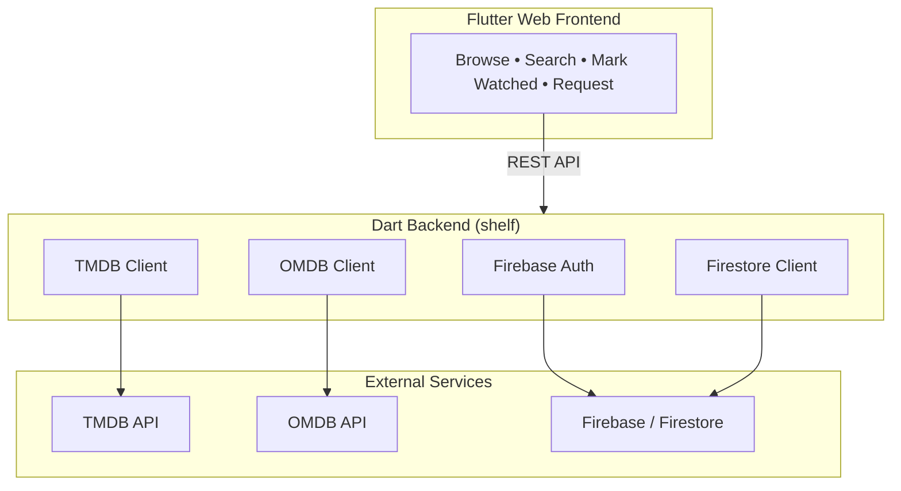
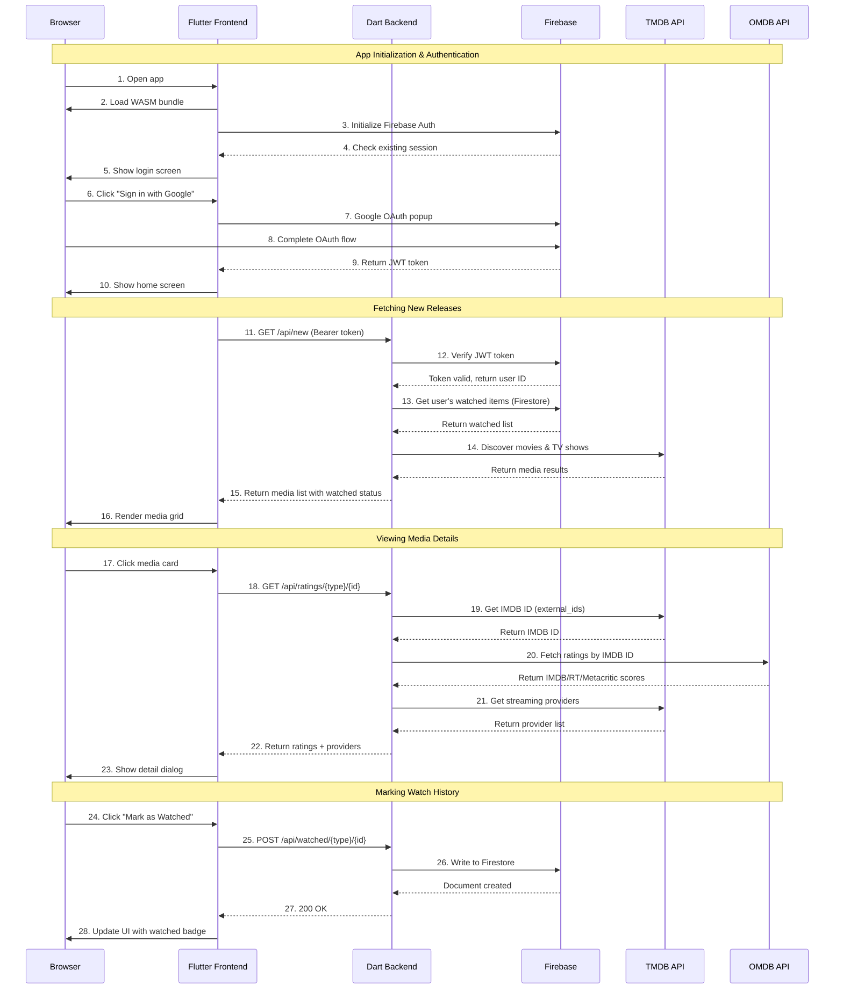

# Downstream

**What's new on streaming?**

A self-hosted web app for discovering new content across Netflix, Disney+, Apple TV+, and more. See what dropped this week, check the ratings, track what you've watched, and request content for download.

Pairs with [downstream-cli](https://github.com/nickmeinhold/downstream-cli) for automated downloading.

```text
┌─────────────────────────────────────────────────────────────────┐
│  DOWNSTREAM                                   nick ▼            │
├─────────────────────────────────────────────────────────────────┤
│                                                                 │
│  ┌─────────┐ ┌─────────┐ ┌─────────┐ ┌─────────┐ ┌─────────┐   │
│  │ ███████ │ │ ███████ │ │ ███████ │ │ ███████ │ │ ███████ │   │
│  │ ███████ │ │ ███████ │ │ ███████ │ │ ███████ │ │ ███████ │   │
│  │ ███████ │ │ ███████ │ │ ███████ │ │ ███████ │ │ ███████ │   │
│  │ ███████ │ │ ███████ │ │ ███████ │ │ ███████ │ │ ███████ │   │
│  │ Arcane  │ │ Dune 2  │ │ Shogun  │ │ Ripley  │ │ 3 Body  │   │
│  │ ★ 9.1   │ │ ★ 8.8   │ │ ★ 8.7   │ │ ★ 8.3   │ │ ★ 8.0   │   │
│  └─────────┘ └─────────┘ └─────────┘ └─────────┘ └─────────┘   │
│                                                                 │
└─────────────────────────────────────────────────────────────────┘
```

## Features

- **Browse new releases** from Netflix, Disney+, Apple TV+, HBO Max, Prime Video, Paramount+, Hulu, Peacock
- **Aggregate ratings** — IMDB, Rotten Tomatoes, Metacritic all in one view
- **Multi-user** — everyone tracks their own watch history via Firebase Auth
- **Where to watch** — see which streaming services have a title
- **Request content** — request movies/shows for download (processed by downstream-cli)

## Architecture



## Sequence Diagram

The following diagram shows the flow when a user opens the web app, authenticates, browses content, and interacts with various APIs:



**Key flows:**

| Step | Description |
| ------ | ------------- |
| 1-10 | App loads, user authenticates via Google OAuth, receives JWT token |
| 11-16 | Home screen fetches new releases from TMDB, marks user's watched items |
| 17-23 | User clicks card, backend fetches ratings from OMDB + providers from TMDB |
| 24-28 | User marks item watched, stored in Firestore under their user ID |

## Quick Start

### 1. Get API Keys

| Service | Purpose | Link |
| --------- | --------- | ------ |
| **TMDB** | Content data & posters | [Get free key](https://www.themoviedb.org/settings/api) |
| **OMDB** | IMDB/RT/Metacritic ratings | [Get free key](https://www.omdbapi.com/apikey.aspx) |
| **Firebase** | Auth & Firestore | [Firebase Console](https://console.firebase.google.com) |

### 2. Configure Environment

```bash
# Required
export TMDB_API_KEY="your-tmdb-key"
export FIREBASE_PROJECT_ID="your-project-id"
export FIREBASE_SERVICE_ACCOUNT='{"type":"service_account",...}'

# Recommended
export OMDB_API_KEY="your-omdb-key"  # For ratings

# Optional
export PORT="8080"  # Default
```

### 3. Build & Run

```bash
# Server
cd server && dart pub get && cd ..

# Frontend
cd webos_app && flutter pub get && flutter build web && cd ..

# Start server (serves webos_app automatically)
cd server && dart run bin/server.dart
```

Open <http://localhost:8080> — sign in with Google and start browsing.

---

## API Reference

### Auth

```http
GET  /api/auth/me    [Bearer token]  →  { user }
```

### Content Discovery

```http
GET /api/new?providers=netflix,disney&type=movie&days=30
GET /api/trending?window=week&type=tv
GET /api/search?q=breaking+bad
GET /api/where?q=the+bear
GET /api/ratings/{movie|tv}/{tmdb_id}
GET /api/providers
```

### Watch History

```http
GET    /api/watched
POST   /api/watched/{movie|tv}/{id}
DELETE /api/watched/{movie|tv}/{id}
```

### Content Requests

```http
GET    /api/requests
POST   /api/requests/{movie|tv}/{id}    { title, posterPath? }
DELETE /api/requests/{movie|tv}/{id}
```

---

## Supported Providers

| Key | Provider |
| ----- | ---------- |
| `netflix` | Netflix |
| `disney` | Disney+ |
| `apple` | Apple TV+ |
| `hbo` | Max (HBO) |
| `prime` | Prime Video |
| `paramount` | Paramount+ |
| `hulu` | Hulu |
| `peacock` | Peacock |

---

## Project Structure

```text
downstream-web/
├── server/           # Dart backend
│   ├── bin/server.dart
│   ├── lib/src/
│   │   ├── server/   # HTTP routes
│   │   ├── services/ # API clients
│   │   └── ...
│   └── pubspec.yaml
├── webos_app/        # LG WebOS TV app (Flutter Web)
│   ├── lib/
│   │   ├── screens/
│   │   ├── widgets/
│   │   └── services/
│   └── pubspec.yaml
├── tizen_app/        # Samsung Tizen TV app (Native Flutter)
│   ├── lib/
│   │   ├── screens/
│   │   ├── widgets/
│   │   └── services/
│   └── pubspec.yaml
└── README.md
```

---

## Tech Stack

| Layer | Tech |
| ------- | ------ |
| Frontend | Flutter Web (WASM) |
| Backend | Dart + shelf |
| Auth | Firebase Auth (Google Sign-In) |
| Database | Cloud Firestore |
| Content | TMDB API |
| Ratings | OMDB API |

---

## Troubleshooting

**"OMDB not configured"**
→ Set `OMDB_API_KEY` for ratings (optional but recommended)

**"Firebase auth failed"**
→ Check `FIREBASE_PROJECT_ID` and `FIREBASE_SERVICE_ACCOUNT` are set correctly

---

## License

MIT
